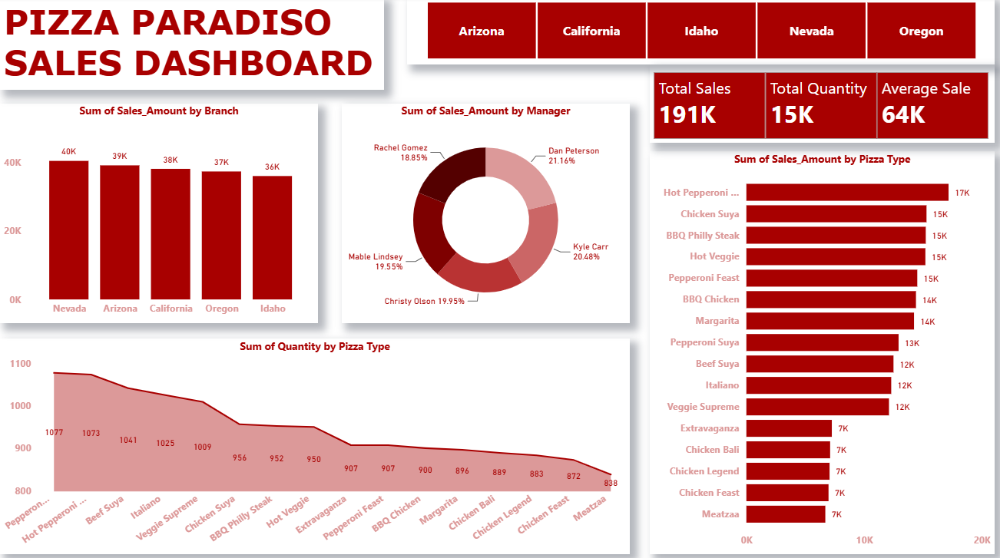

# 🍕 Pizza Paradiso Sales Dashboard

An interactive Power BI dashboard built to analyze sales performance across Pizza Paradiso branches. The dashboard provides insights into revenue, product performance, branch comparison, and manager contributions to support data-driven business decisions.

---

## Dashboard Preview

<p align="center">

</p>

---

## Business Problem

Restaurant chains generate large volumes of sales data across different locations. Without effective visualization, identifying high-performing branches, popular menu items, and regional trends becomes difficult.

This dashboard transforms raw sales data into actionable business insights through interactive visualizations.

---

## Features

- 📊 Branch-wise Sales Analysis
- 🍕 Sales by Pizza Type
- 📦 Quantity Sold Analysis
- 👨‍💼 Manager Performance Comparison
- 🌎 State-wise Interactive Filters
- 📈 KPI Cards for Business Monitoring

---

## Dashboard Insights

- Nevada generated the highest sales.
- Hot Pepperoni Pizza recorded the highest revenue.
- Pepperoni-based pizzas dominated total quantity sold.
- Sales are relatively balanced across all branches, indicating consistent regional performance.

---

## Tools & Technologies

- Power BI
- Power Query
- DAX
- Data Modeling
- Interactive Visualizations

---

## Skills Demonstrated

- Dashboard Design
- Data Cleaning
- Data Modeling
- KPI Development
- Business Intelligence
- Data Visualization

---

## Project Structure

```
Dashboard/
    Pizza_Paradiso_Dashboard.pbix
    dashboard.png
Dataset/
    pizza_sales.csv
README.md
```

---

## Future Improvements

- Customer segmentation analysis
- Monthly and yearly sales trends
- Profit analysis
- Predictive sales forecasting
- Inventory analytics

---

## Author

**Devesh Chauhan**

If you found this project interesting, feel free to ⭐ the repository.
